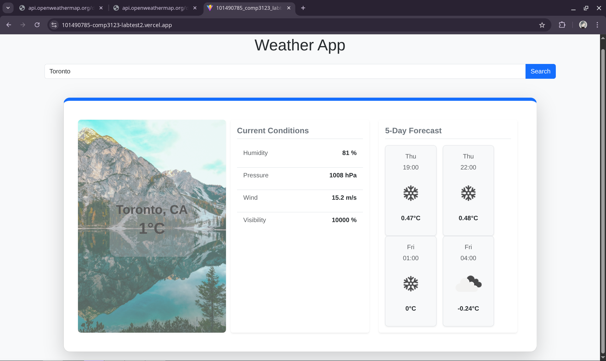
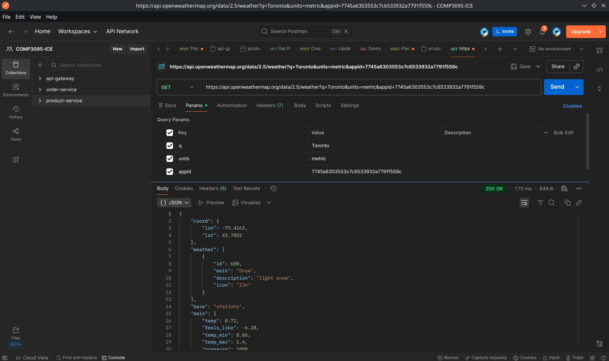

# 🌤 Weather App

A simple weather dashboard built with **React + Vite + Bootstrap + Axios** that allows users to search for a city and view:
- Current temperature and weather conditions
- Humidity, pressure, wind, visibility
- 4-day forecast

---
## Deployment
https://101490785-comp3123-labtest2.vercel.app/
---

## 🌍 Weather API Used
The project uses the **OpenWeatherMap API**:

- **Current Weather API**  
  https://api.openweathermap.org/data/2.5/weather

- **5-Day Forecast API**  
  https://api.openweathermap.org/data/2.5/forecast

---
## Screenshots

